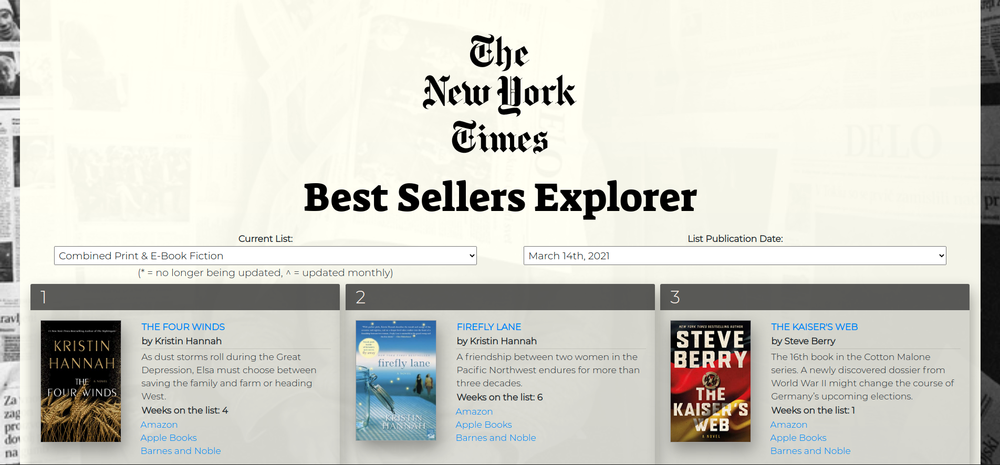
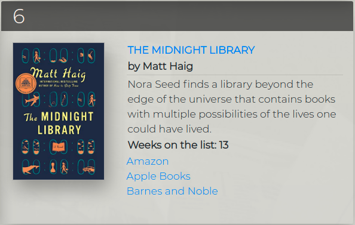

# The New York Times Best Sellers Explorer

Users can explore the New York Times Best Sellers by list and date. The page also connects users to the places to buy them and see reviews.

Click a book cover and you are lead to it's Goodreads page, or click your online store to buy it.

## Technologies Used
- HTML5
- CSS3
- JS
- jQuery
- Bootstrap
- [The New York Times Books API](https://developer.nytimes.com/docs/books-product/1/overview/)
- Vercel (for deployment)
 
---

### Pictures

Each book has a card that display's rank and more info about the title.

### Mobile Screen

Works on mobile screens just as well as desktop.

---

# Getting Started 

## [Click here](https://nyt-bs-explorer.vercel.app/) to open up the app and exploring.

---

#### *Disclaimer*

*This is an educational project. I am by no means affliated with or work for The New York Times.*
