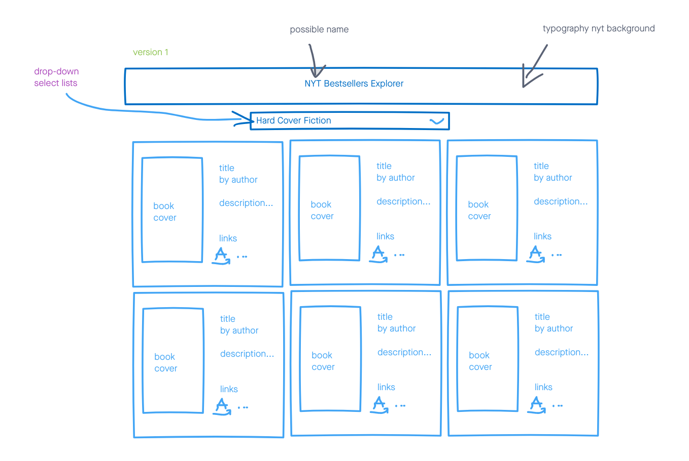
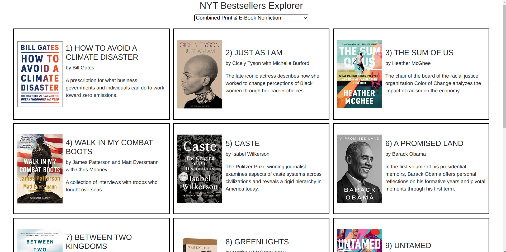
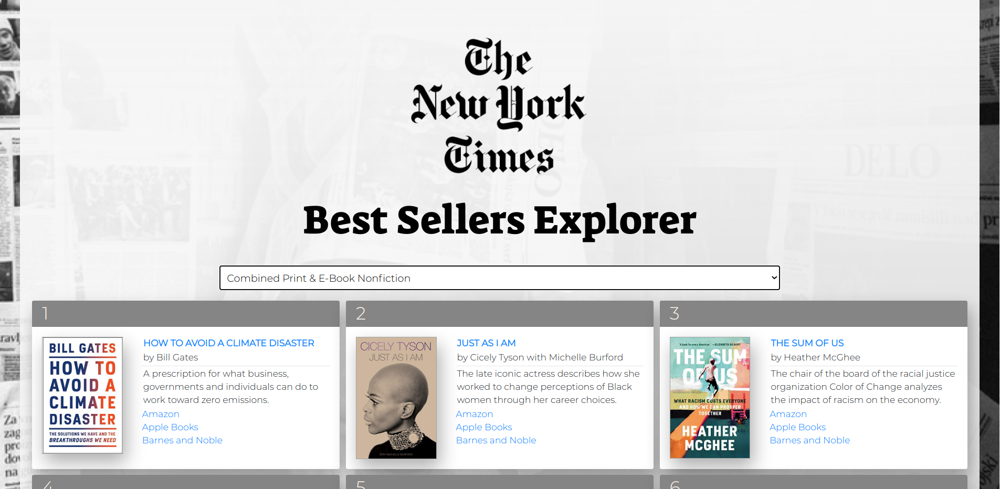
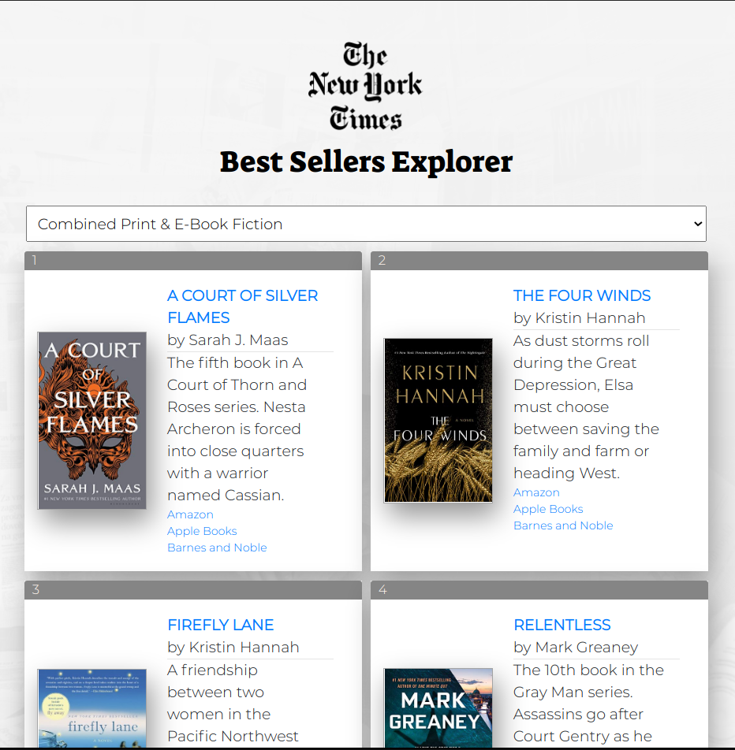
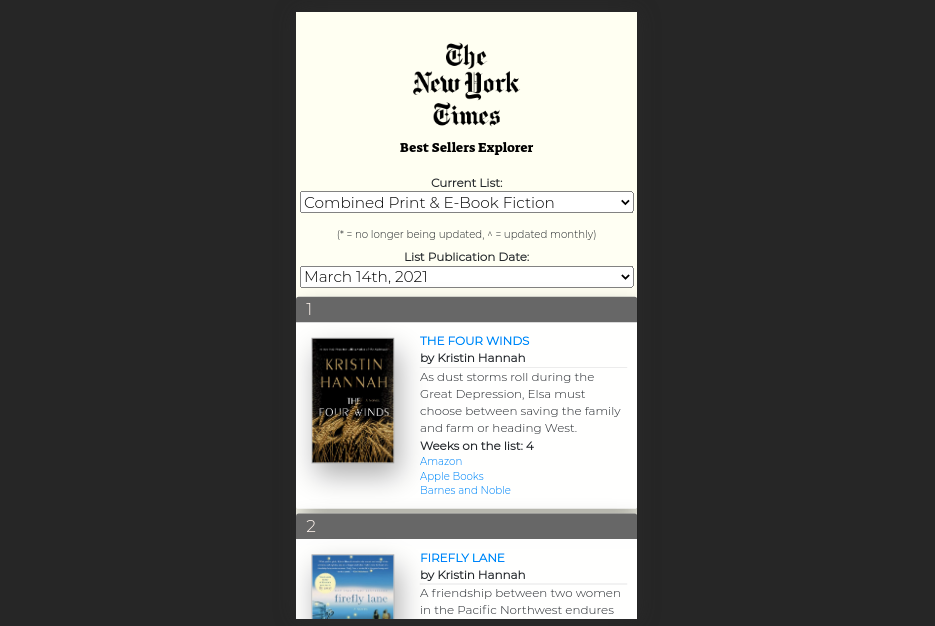

# NYT

A web-based app that displays the New York Times Best Sellers and connects users to the places to buy them.

## Technologies Used
- HTML5
- CSS3
- JS
- jQuery
- [NYT Books API](https://developer.nytimes.com/docs/books-product/1/overview/)
- Vercel (for deployment)

##  Wireframe

## Pictures

### Pre-Styling

### Post-Styling (Large Screen)

### Mid-size Screen

### Mobile Screen

## Getting Started 

<<<<<<< HEAD
[Click here](https://nyt-bs-explorer.vercel.app/)
=======
[Click here](https://nyt-bs-explorer.vercel.app/) to open up the app and explore.

## Future 

- Enable a date function so users can go back and see past lists.
- Make a loading screen to wait for AJAX response.
>>>>>>> 935cda376eda47ef7551fe8cd9c532f2b467f973
